<p align="center">
  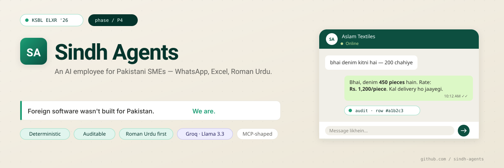
</p>

<p align="center">
  <a href="phase/MVP_v1.md"></a>
  
  
  
  
  
</p>

---

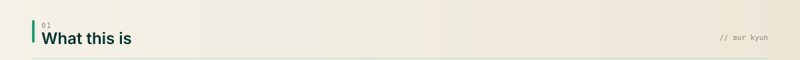

Pakistani SMEs run on WhatsApp and Excel. Buyers message all day — *"denim kitni hai"*, *"rate kya hai"*, *"chalan bhejo"* — and the owner spends three hours a day just relaying answers between the two.

Sindh Agents drops an AI worker into that loop.

- **Deterministic engine** looks up the real number in Excel / Postgres.
- **LLM narrates** it in polite Roman Urdu.
- **Never invents a price.** Every reply hash-links back to the source row.

Built for the KSBL ELXR'26 *Import Substitution Engine* hackathon. Product brief lives in the vault at `Hackathons/Sindh Agents/Sindh_Agents_Project_Brief.md`.

---

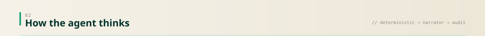

<p align="center">
  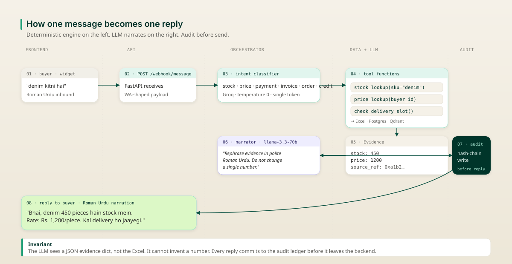
</p>

Read the diagram in three passes:

1. **Inbound.** Buyer → widget → webhook → orchestrator.
2. **Lookup + narrate.** Orchestrator asks tools for *evidence*, then hands evidence + a strict prompt to the LLM. The LLM sees a JSON dict, not the Excel.
3. **Audit-first outbound.** The reply commits to the audit ledger *before* it leaves the backend. No unaudited replies. Ever.

---

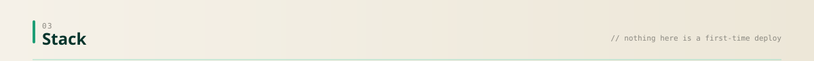

<p align="center">
  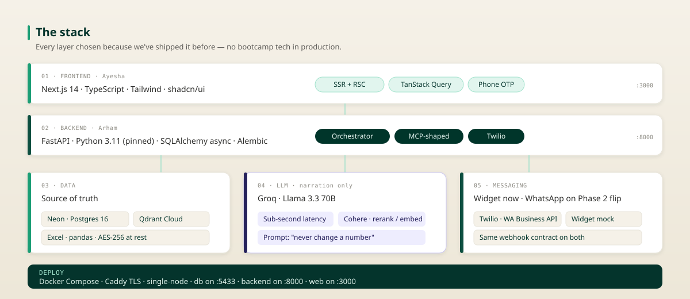
</p>

Nothing here is a first-time deploy. Every choice was proven by one of us on a prior project — Ayesha shipped Qdrant + Neon on the textbook chatbot; Arham shipped the deterministic-engine-plus-narrator pattern on ZeroBalance. See `docs/CLAUDE.md` §3 for the locked stack and `Hackathons/Sindh Agents/Architecture.md` in the vault for the reasoning.

---

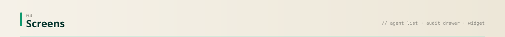

**1. Agents overview.** Owner opens the dashboard, sees which agents are working today, glances at unread conversations.

<p align="center">
  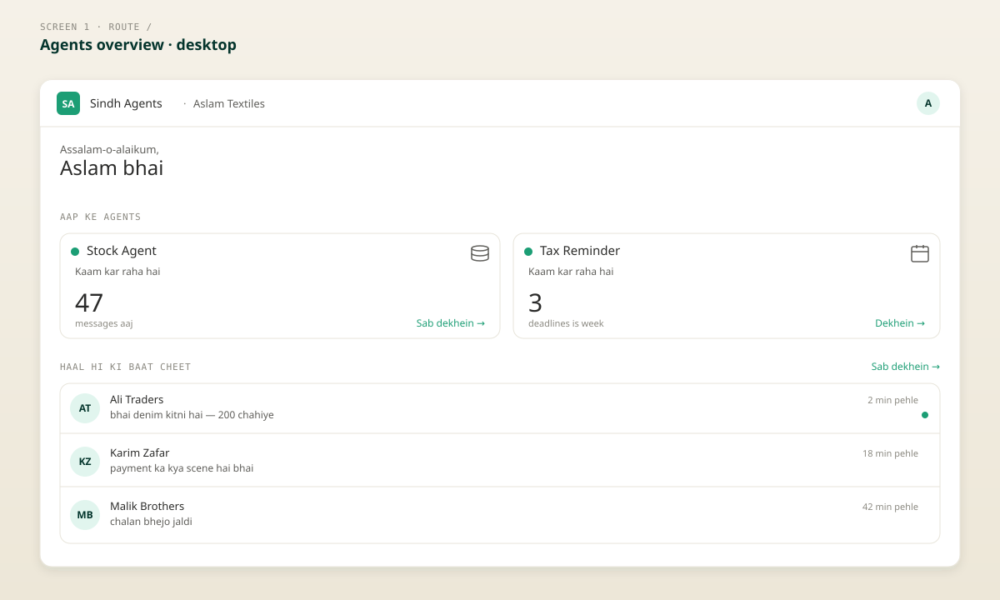
</p>

**2. Conversation + audit drawer.** *"Yeh jawaab kaise bana?"* — every reply can be traced. Buyer message, agent's interpretation, tools called with timing, model used, evidence values. If something is wrong, flag it.

<p align="center">
  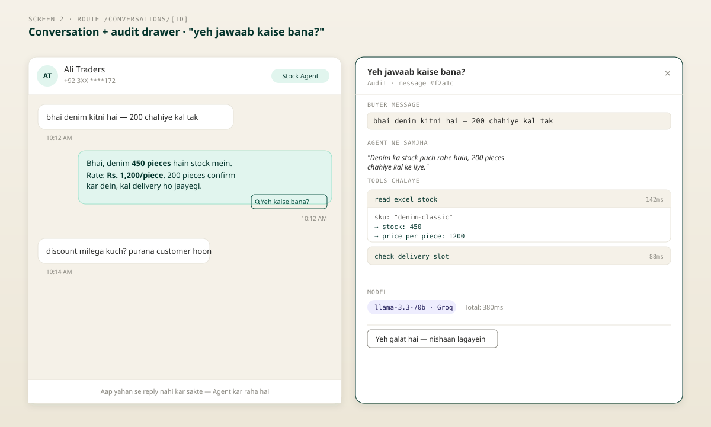
</p>

**3. Buyer-facing widget.** WhatsApp look-alike. Same webhook payload shape as Meta's real WhatsApp Business API — Phase 6 flips one env var and the exact same backend serves real WhatsApp traffic.

<p align="center">
  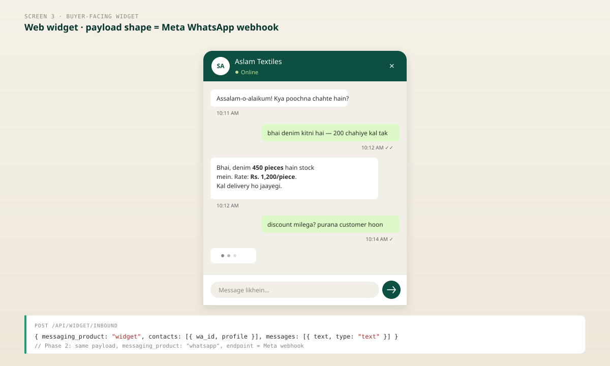
</p>

The full interactive HTML mockup lives at `docs/assets/dashboard_mockup.html`.

---

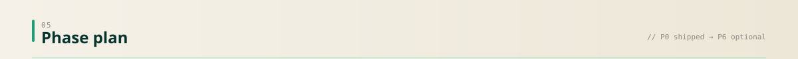

<p align="center">
  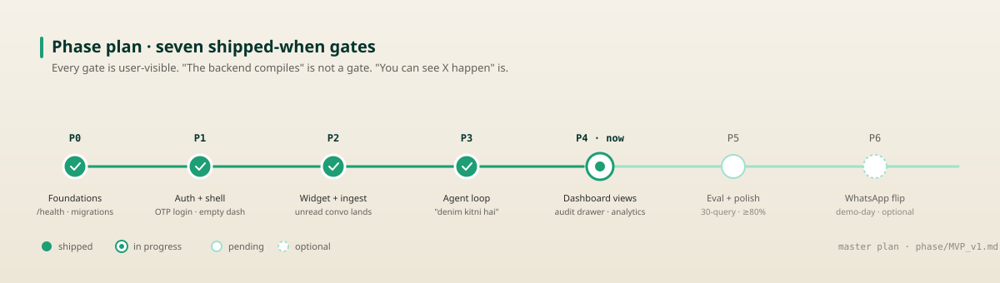
</p>

Feature-phased. Every gate is user-visible. *"The backend compiles"* is not a gate. *"You can see X happen"* is.

| Phase | Ships when |
|---|---|
| **P0** · shipped | `curl /health` returns 200; DB migrated |
| **P1** · shipped | Owner logs in with OTP, lands on empty dashboard |
| **P2** · shipped | Buyer types in widget; message appears in dashboard as unread |
| **P3** · shipped | Buyer asks *"denim kitni hai"*, agent replies with real number from Excel |
| **P4** · **now** | SME sees agent list, conversation thread, audit drawer |
| **P5** · pending | Baneen's 30-query Roman Urdu eval passes ≥80% hard-fail; Lighthouse mobile ≥90 |
| **P6** · optional | Judge messages the agent from real WhatsApp; agent replies on WhatsApp |

Master plan: `phase/MVP_v1.md`. Each `phase/P*.md` is a shipped log — written the day the phase starts, not upfront.

---

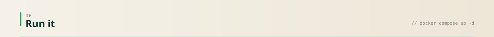

### Setup

```bash
git clone <repo>
cd sindh-agents
cp .env.example .env
# Fill in .env — see docs/env_setup.md for what each var does
```

### Docker (recommended)

Three containers: `db`, `backend`, `web`. No Python or Node version to manage locally.

**First-time setup** — migrations must run once `db` is healthy but before `backend` starts serving, so that's a separate one-off step:

```bash
cd infra
docker compose -f docker-compose.dev.yml up -d db
docker compose -f docker-compose.dev.yml run --rm backend alembic upgrade head
docker compose -f docker-compose.dev.yml up -d backend web
```

**Every time after** — migrations already applied, `db_data` volume persists them, so one command brings up all three services:

```bash
cd infra
docker compose -f docker-compose.dev.yml up -d
```

- `db` publishes on **5433** (not 5432) to avoid clashing with any other local Postgres.
- `backend` on **8001** (host) → 8000 (container) — remapped from 8000 since that port is commonly taken by other local projects. `web` on **3000**.
- Source is bind-mounted, so edits hot-reload without rebuild.

Rebuild only when `pyproject.toml` or `package.json` changes:

```bash
docker compose -f docker-compose.dev.yml build backend web
```

Migrations don't auto-run on boot. Rerun `alembic upgrade head` (via the one-off command above) whenever a new migration lands.

<details>
<summary><b>Gotcha — <code>web</code>'s <code>node_modules</code></b></summary>

`web`'s `node_modules` lives in an anonymous volume so the bind-mounted source doesn't shadow it. That volume persists across rebuilds. If `web` logs *"Module not found"* for a package you just added, nuke the volume:

```bash
docker compose -f docker-compose.dev.yml rm -f -s -v web
docker compose -f docker-compose.dev.yml build web
docker compose -f docker-compose.dev.yml up -d web
```
</details>

<details>
<summary><b>Everyday Docker commands</b></summary>

```bash
docker compose -f docker-compose.dev.yml down             # stop everything
docker compose -f docker-compose.dev.yml logs -f backend  # tail backend
```
</details>

### Native (alternative)

Backend is pinned to **Python 3.11** in `docs/CLAUDE.md` §3. Don't substitute another version.

```bash
# Backend
cd apps/backend
py -3.11 -m venv .venv && .venv\Scripts\activate           # Windows
# python3.11 -m venv .venv && source .venv/bin/activate    # macOS/Linux
pip install -e ".[dev]"
cp ../../.env .env
alembic upgrade head
uvicorn src.main:app --reload --port 8000

# Frontend (new terminal)
cd apps/web
copy ..\..\.env .env.local                                 # Windows
# cp ../../.env .env.local                                 # macOS/Linux
npm install
npm run dev
```

### Verify

```bash
curl http://localhost:8001/health   # Docker — see backend port note above
# curl http://localhost:8000/health  # Native
# {"ok": true}
```

### Common tasks

```bash
# Tests
cd apps/backend && pytest
cd apps/web     && npm test

# Typecheck
cd apps/backend && mypy src
cd apps/web     && npm run typecheck

# Format / lint
cd apps/backend && black src && ruff check --fix src
cd apps/web     && npm run format

# Reset dev DB
cd apps/backend && alembic downgrade base && alembic upgrade head
```

---

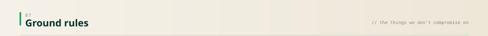

- **The LLM never invents a number.** Prices, stock, dates, amounts come from Excel or Postgres. The LLM narrates.
- **Every reply is written to the audit ledger before it goes back to the buyer.** No unaudited replies.
- **Roman Urdu is the default.** English is the fallback.
- **Every PR names its phase in the title.** `feat(P3): agent orchestrator + tool executor`.
- **No emojis in code, comments, commits, or logs. No commented-out code. No un-owned TODOs.** See `docs/CLAUDE.md` §2.

---

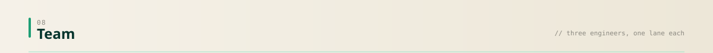

| | Role | Owns |
|---|---|---|
| **Arham** ([@Arhamurrahemeen](https://github.com/Arhamurrahemeen)) | Chief Agent Architect | Backend, orchestrator, Excel engine, MCP-shaped tools |
| **Ayesha** | Head of Agent Memory | Qdrant / RAG, Next.js dashboard, frontend integration |
| **Baneen** ([@Baneenraza](https://github.com/Baneenraza)) | Head of Agent Reliability | Roman Urdu eval corpus, accuracy scoring, SQA |

All three: DUET CSE, Batch 2023 (7th sem), Karachi. Three years of collaboration baseline before this repo existed.

---

### Docs to read (in order)

1. `docs/CLAUDE.md` — invariants, stack, style rules
2. `phase/MVP_v1.md` — build plan
3. `docs/api-contract.md` — routes, request/response, errors
4. `docs/db_schema.md` — 12 tables, migrations
5. `docs/tools_spec.md` — agent tools and their evidence contracts
6. `docs/dashboard_spec.md` — every screen and component
7. `docs/env_setup.md` — every env var, what it does, where it's used

### License

Proprietary. All rights reserved.

<p align="center" style="margin-top: 24px;">
  <sub>Built for Karachi. Built here, for here.</sub>
</p>
